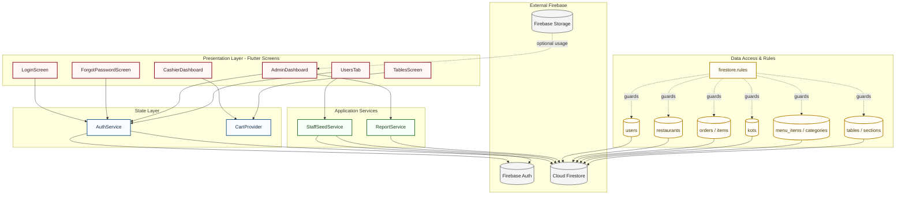
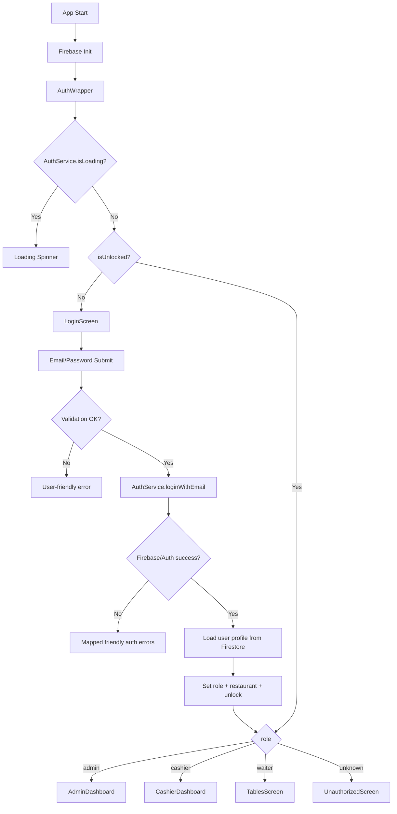
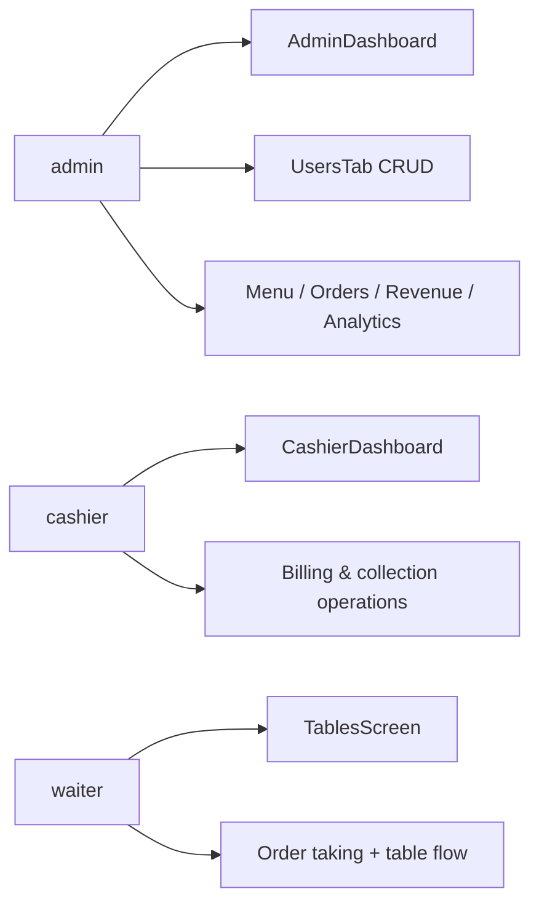
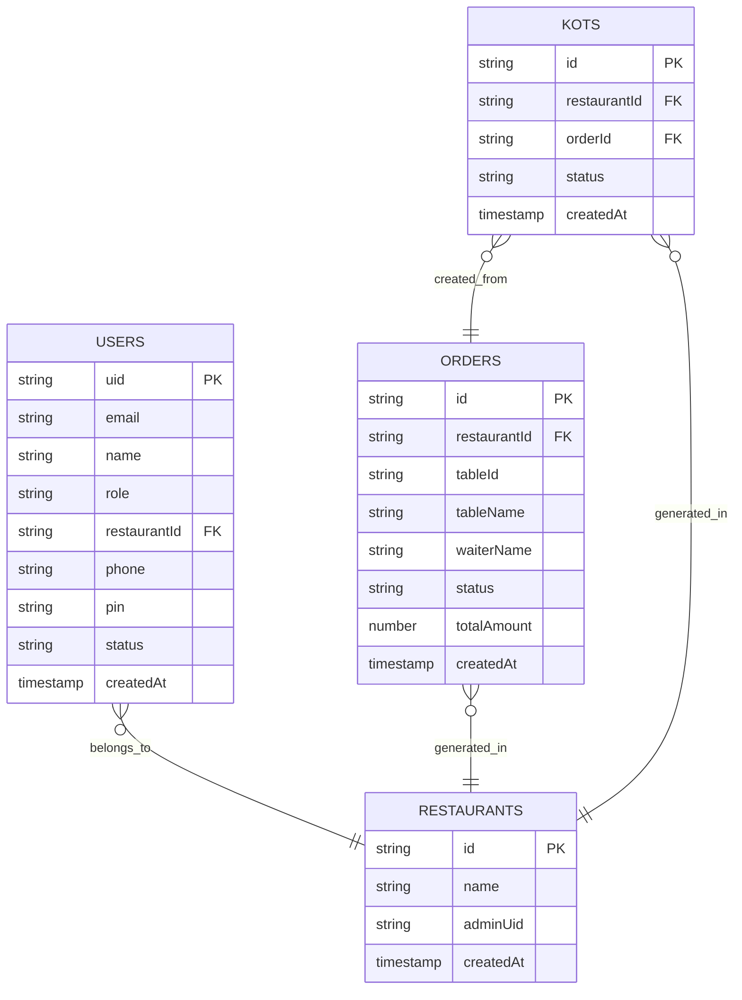

# ShreeRajmandir System Architecture (Visual)

This file provides a **designed architecture view** (not just a basic text mindmap), with separate diagrams for layers, runtime flow, and domain/data.

## 1) Layered Architecture

## 2) Auth + Routing Runtime Flow

## 3) Role Capability Map

## 4) Data Model Snapshot

## 5) Operational Notes

- Current active role system in code: `admin`, `cashier`, `waiter`.
- Authentication errors are mapped to user-friendly text.
- Forgot password has validation + cooldown + spam-folder guidance.
- Multi-tenant data scoping uses `restaurantId` and Firestore rules.
